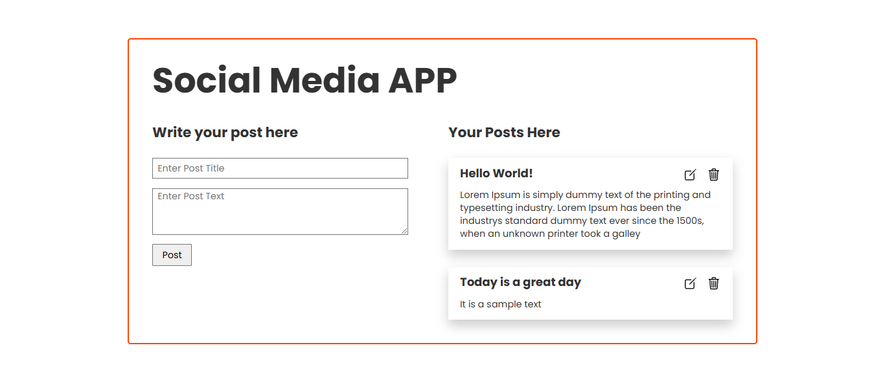
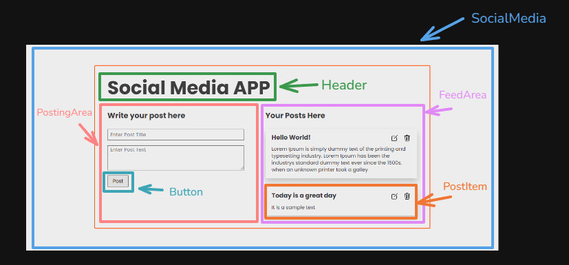
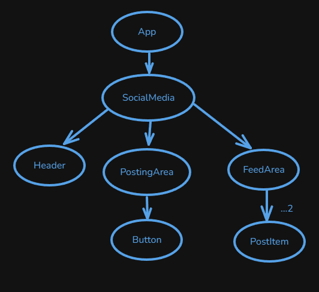

# Social Media

It is a simple social media app where user can share their thought or anything they want.

## Table of Contents

- [Run it Locally](#run-it-locally)
- [Screenshots](#screenshots)
- [Necessary Links](#necessary-links)

## Run it Locally

Please follow the below instructions to run this project in your machine:

1. Clone this repository

   ```sh
       git clone https://github.com/sagormajomder/social-app.git
   ```

2. To run below command, your machine must have install nodejs

- Install project dependencies

  ```sh
      npm install
  ```

- Run the project
  ```sh
      npm run dev
  ```

The app will be available on http://localhost:5173 by default.

## Screenshots

- UX design Diagram
  

- Component Breakdown diagram
  

- Component Hierarchy diagram
  
  

## Necessary Links

- Repository link: [Github repository](https://github.com/sagormajomder/social-app)
<!-- - App live link : [tapascript-car live](https://tapascript-cars.netlify.app/) -->
