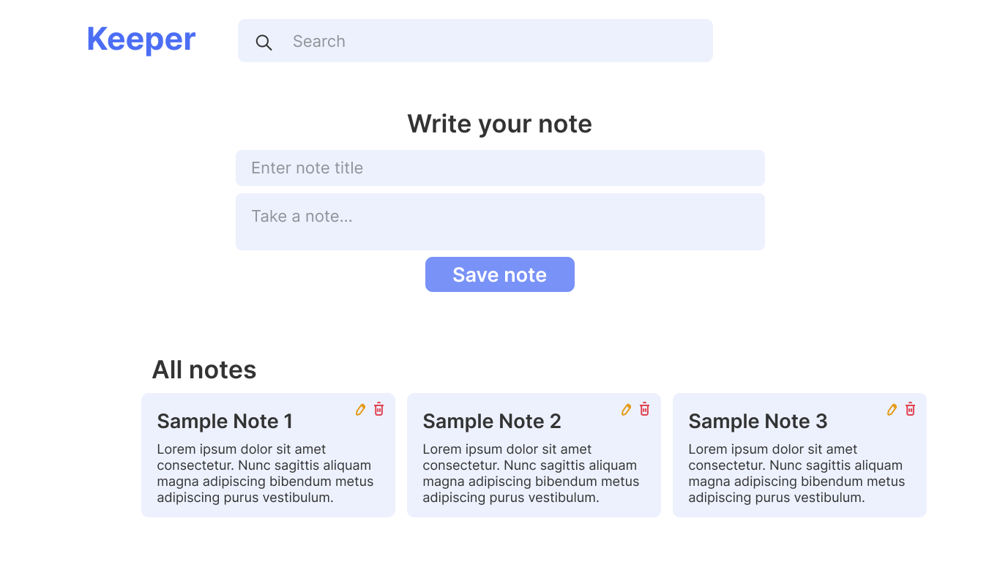
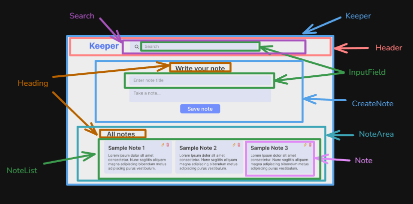
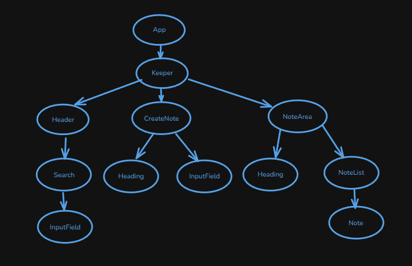

# Keeper

It is a simple note taking app where user can write their thought or anything they want.

## Table of Contents

- [App features](#features)
- [Future Planning](#future-planning)
- [Technology Used](#technology-used)
- [Run it Locally](#run-it-locally)
- [Screenshots](#screenshots)
- [Necessary Links](#necessary-links)

## Features

In this app user get some features such as

- create note
- delete note
- update existing note
- search specific note

## Future Planning

In future, some features can be added such as

- update UI for more friendly user experience
- create note with checklist and upload photo
- create folder to store related notes
- add level to note

## Technology Used

- React v19
- Tailwindcss v4

## Run it Locally

Please follow the below instructions to run this project in your machine:

1. Clone this repository

   ```sh
       git clone https://github.com/sagormajomder/keeper.git
   ```

2. To run below command, your machine must have install nodejs

- Install project dependencies

  ```sh
      npm install
  ```

- Run the project
  ```sh
      npm run dev
  ```

The app will be available on http://localhost:5173 by default.

## Screenshots

- UX design Diagram
  

- Component Breakdown diagram
  

- Component Hierarchy diagram
  

## Necessary Links

- Repository link: [Github repository](https://github.com/sagormajomder/keeper)
- Design link: [Figma](https://www.figma.com/design/UWbWBP3YU9LEVkIUKZ9zJe/Keeper?node-id=0-1&t=HRaJ4T1wvW8JaZcj-1)
- App live link : [keeper live](https://sm-keeper.netlify.app/)
